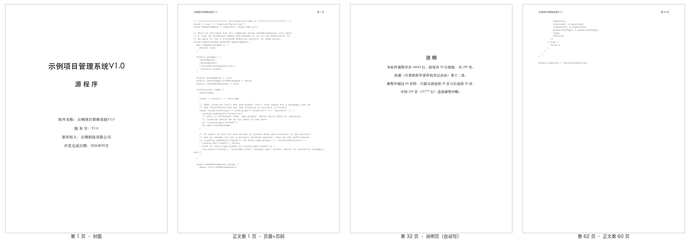

<div align="center">

# ruanzhu-kit

**Generate China software-copyright (软著) registration materials from your source tree — with page counts that never drift.**

[](https://github.com/CatCatUncle/ruanzhu-kit/actions/workflows/test.yml)
[](LICENSE)
[](package.json)
[](package.json)
[](SKILL.md)

[中文](README.md) · **English**

</div>

> [!IMPORTANT]
> ### 🤝 Best used with [OpenWorkBuddy](https://github.com/CatCatUncle/openworkbuddy)
>
> **[OpenWorkBuddy](https://github.com/CatCatUncle/openworkbuddy) — the best local, open-source AI office agent.** It runs on your own machine, plans and does the work,
> and hands you real PPTX / DOCX / XLSX / HTML files. Works with DeepSeek, Qwen, Doubao, Claude or Ollama.
>
> - 🏢 **Built for on-prem enterprise deployment** — data stays on your machine / intranet; Docker one-command deploy
> - 🛠️ **Commercial use & custom development** — free for personal use; commercial licenses available for companies
> - 🧩 **ruanzhu-kit is an OpenWorkBuddy skill** — drop it into `skills/` and just ask for the 软著 materials
>
> ⭐ **If this helps, please star both [ruanzhu-kit](https://github.com/CatCatUncle/ruanzhu-kit) and [OpenWorkBuddy](https://github.com/CatCatUncle/openworkbuddy).**

Registering software copyright in China (with the Copyright Protection Center of China, CPCC) requires a
source-code PDF: if your code runs longer than 60 pages you submit **the first 30 and the last 30 pages**,
at no fewer than 50 lines per page, with the software name and version in every page header.
Laying this out in Word is fragile — page counts shift with fonts, versions and printer drivers, and one
drifted page means redoing the whole package.

`ruanzhu-kit` computes every page break **before** rendering (accounting for wrapped long lines and
double-width CJK characters), renders with headless Chrome, then reads the PDF back to verify page
count, cover, the omission-note page, headers and page numbers.



## Quick start

Requires Node 18+ and Chrome / Chromium / Edge 131+ (`CHROME_PATH` to override).

```bash
cd your-project
npx github:CatCatUncle/ruanzhu-kit init    # writes ruanzhu.config.json + a manual skeleton
npx github:CatCatUncle/ruanzhu-kit count   # which files, how many lines, how many pages
npx github:CatCatUncle/ruanzhu-kit all     # both PDFs + a form checklist, then self-checks
```

## What you get

| File | Purpose |
|---|---|
| `①程序鉴别材料_…pdf` | Source-code material: cover + first 30 pages + omission note + last 30 pages (62 pages) |
| `②文档鉴别材料_…pdf` | User manual rendered from `说明书.md` |
| `表单填写清单.md` | Copy-paste values for every online form field, with length checks |

## Use it as an AI agent skill

[`SKILL.md`](SKILL.md) follows the common agent-skill format (Claude Code, Claude Agent SDK):

```bash
git clone https://github.com/CatCatUncle/ruanzhu-kit.git ~/.claude/skills/ruanzhu-kit
```

Then just ask your agent to "prepare the 软著 materials for this project".

## Disclaimer

This is a layout and counting tool, not legal advice. Check the copyright owner, code volume and supporting
documents yourself before submitting; [CPCC](https://register.ccopyright.com.cn/) rules prevail.

## About the author

Former big-tech Agent engineer. AI solutions delivered for cross-border e-commerce, manufacturing, AI startups,
private-equity funds, consumer-goods leaders and state-owned enterprises — corporate AI training, private
deployment, industry agents, AI search optimization (GEO) and Agent project delivery. Based in Shenzhen.

> [!IMPORTANT]
> ## 🚀 We take on enterprise FDE (Forward Deployed Engineering) and AI delivery projects
>
> - **FDE on-site engineering** — take agents from demo to production that people actually use
> - **Private / on-prem deployment** of OpenWorkBuddy and other agents
> - **Industry agents**, **custom Agent development**, **corporate AI training**, **AI search optimization (GEO)**
>
> ### 📮 Email: **[contact@aijentra.com](mailto:contact@aijentra.com)**

If this saved you a redo, please ⭐ **[ruanzhu-kit](https://github.com/CatCatUncle/ruanzhu-kit)** and **[OpenWorkBuddy](https://github.com/CatCatUncle/openworkbuddy)** — it helps others find them.

MIT License.
